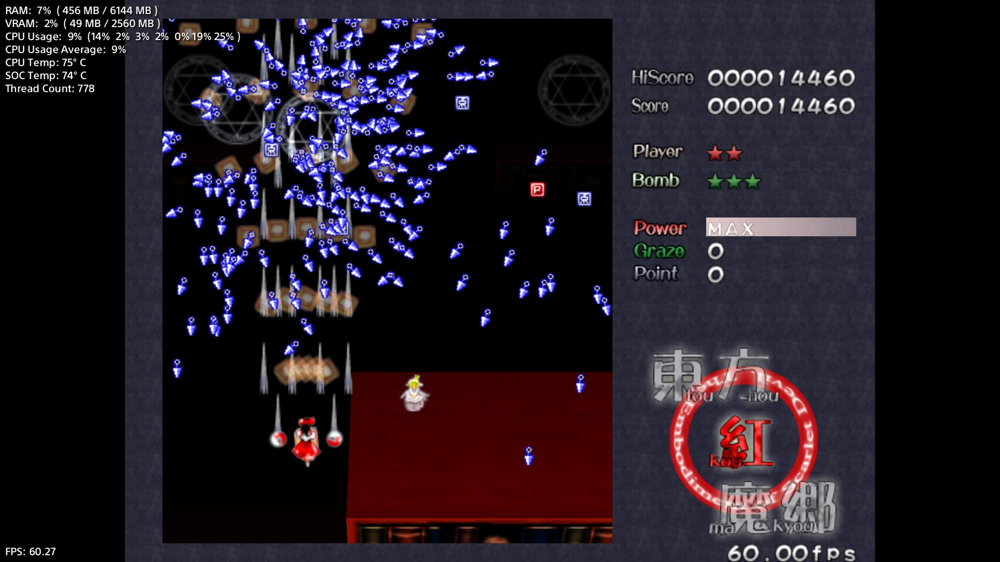
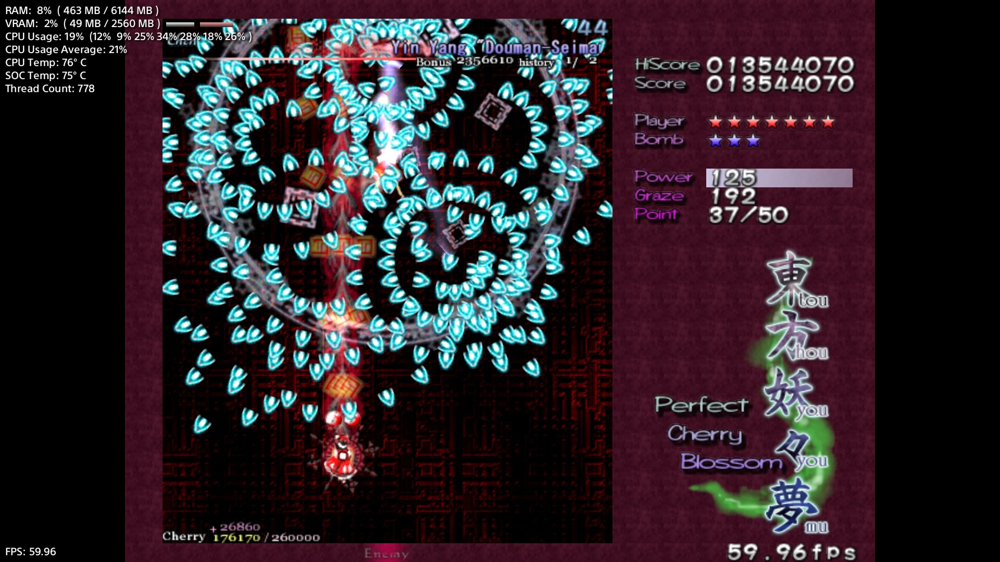
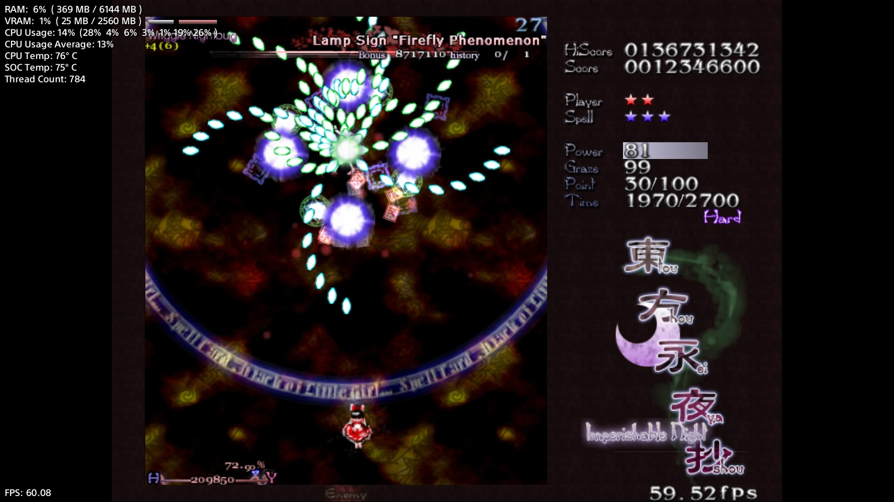

# Touhou PS4 Collection

A growing collection of native PlayStation 4 ports of Touhou Project games. Each port recompiles a
community decompilation or reconstruction of the original Windows game for PS4, with a native
renderer and the console-specific work it needs, and new games are added to the same repository
as they are ported.

## Games in the collection

| Game | Version | PS4 title ID | Data folder on the PS4 |
|---|---|---|---|
| [Touhou 6: The Embodiment of Scarlet Devil](#touhou-6-the-embodiment-of-scarlet-devil) | `v1.02h` | `THSP00006` | `/data/touhou/th06/` |
| [Touhou 7: Perfect Cherry Blossom](#touhou-7-perfect-cherry-blossom) | `v1.00b` | `THSP00007` | `/data/touhou/th07/` |
| [Touhou 8: Imperishable Night](#touhou-8-imperishable-night) | `v1.00d` | `THSP00008` | `/data/touhou/th08/` |

Every port replaces the original DirectX renderer with an OpenGNM/VideoOut backend that creates
native GPU command buffers and presents directly through the console. SDL2 is used for input,
audio and timing. No Windows executable, Wine, DXVK or CPU emulation is involved. The ports share
the PS4 platform layer, packaging and translation support in `ps4/common/`, and each game keeps
its own source in `src/thXX/` and its package target in `ps4/thXX/`.

> [!IMPORTANT]
> This repository contains source code only. It does **not** contain any of the games, music, DAT
> archives, fonts, Sony system modules, translation downloads or a distributable full-game PKG.
> You must provide files from legally obtained copies of the games.

> [!WARNING]
> Every port in the collection has been tested on real PS4 hardware, but visual issues may still
> occur. Depending on the game-data revision and optional translation patches, some assets may be
> missing, incorrectly positioned or displayed with texture-related glitches. When reporting one of
> these problems, include the affected game and screen, the data/patch version, a screenshot or
> video, and the relevant excerpt from `ps4_log.txt` without personal information.

The collection is not affiliated with Team Shanghai Alice, ZUN, Sony Interactive Entertainment or
the upstream decompilation teams. Touhou Project and all original game assets belong to their
respective rights holders.

## Touhou 6: The Embodiment of Scarlet Devil

The TH06 port is based on the GPL-3.0 `portable` work from
[happyhavoc/th06](https://github.com/happyhavoc/th06), itself derived from the
[GensokyoClub TH06 decompilation](https://github.com/GensokyoClub/th06).

PS4-specific work includes:

- a native OpenGNM renderer with VideoOut presentation;
- SDL2 controller, audio, timing and USB-keyboard support;
- writable configuration, score, replay and log files under `/data/touhou/th06/`;
- a lightweight runtime for compatible thcrap translation data;
- 1080p output with runtime 4:3 or 16:9 presentation;
- an **Options-menu change that replaces Fullscreen/Windowed with 4:3/16:9**;
- PS4-safe filesystem, memory and package handling.

### TH06 gameplay screenshot



## Touhou 7: Perfect Cherry Blossom

The TH07 port is based on the CC0 `portable` decompilation from
[cardanawandra/th07](https://github.com/cardanawandra/th07).

PS4-specific work includes:

- a native OpenGNM renderer with correct 2D/3D state transitions, blending and depth handling;
- SDL2 input, audio and timing, with the original mixer feeding the SDL audio callback;
- PS4-safe score, replay and configuration paths under `/data/touhou/th07/`;
- lightweight thcrap support for dialogue, spell cards, Music Room, results and translated
  textures;
- automatic two-line wrapping for long translated dialogue;
- 1080p output with runtime 4:3 or 16:9 presentation;
- an **Options-menu change that replaces Fullscreen/Windowed with 4:3/16:9**;
- fixes for replay loading and the original PC controller configuration on PS4.

### TH07 gameplay screenshot



## Touhou 8: Imperishable Night

The TH08 port is based on the MIT-licensed
[N0zoM1z0/th08](https://github.com/N0zoM1z0/th08) reconstruction (`port/portable-64bit`, its
native 64-bit runtime), which continues the public
[GensokyoClub TH08 decompilation](https://github.com/GensokyoClub/th08).

PS4-specific work includes:

- a Direct3D 8 implementation on OpenGNM: pre-transformed and projected geometry, the separate
  colour/alpha texture stages, fog, depth and scissoring as the original expects;
- SDL2 input, audio and timing through the reconstruction's Linux compatibility layer, with the
  BGM streamer no longer able to stall sound effects while it reads `thbgm.dat`;
- PS4-safe score, replay, configuration and log paths under `/data/touhou/th08/`;
- 64-bit fixes where the original code assumed 32-bit sizes (effects, bullets, options and
  dialogue state), including the Spell Practice retry crash;
- a boss life-bar fix that keeps the bar across phase changes on every stage, matching the
  original executable;
- thcrap-lite support for IN's dialogue scripts (including boss titles and names), spell card
  names, Music Room titles and comments, menu descriptions and help text, translated textures
  and the translation's Latin font, with long lines narrowed to fit their box;
- 1080p output with runtime 4:3 or 16:9 presentation;
- an **Options-menu change that replaces Fullscreen/Windowed with 4:3/16:9**;
- the ZUN cheat code on the controller: on the Result → Score difficulty screen press
  ↑ ↑ ↓ ↓ ← → ← → Cross Circle.

### TH08 gameplay screenshot



## Controls

| DualShock 4 | Touhou 6 | Touhou 7 | Touhou 8 |
|---|---|---|---|
| Cross | Shoot / confirm | Shoot / confirm | Shoot / confirm |
| Circle | Bomb / cancel | Bomb / cancel | Bomb / cancel |
| L1 | Focus | — | — |
| R1 | Skip dialogue | Focus | Focus |
| Triangle | — | Skip dialogue | Skip dialogue |
| Options | Pause / menu | Pause / menu | Pause / menu |
| D-pad / left stick | Move / navigate | Move / navigate | Move / navigate |

TH06 retains its in-game key configuration where supported. TH07 imposes the tested PS4 layout
even if an older PC configuration file is present. TH08 maps the DualShock 4 onto the game's own
controller defaults, so the layout above is what a fresh configuration uses.

## Installing on a PS4

You need a PS4 capable of running homebrew with GoldHEN and a way to install a `.pkg` file. A
public release PKG should contain only the port executable and open build-time components.

1. Install the matching thin PKG using GoldHEN's Package Installer.
2. Enable GoldHEN FTP and copy your own game files to the paths below.
3. Launch the game. Writable files are created beside the game data.

### Touhou 6 data layout

```text
/data/touhou/th06/
├── 紅魔郷CM.DAT
├── 紅魔郷ED.DAT
├── 紅魔郷IN.DAT
├── 紅魔郷MD.DAT
├── 紅魔郷ST.DAT
├── 紅魔郷TL.DAT
├── bgm/
│   └── ... your TH06 WAV files ...
├── msgothic.ttc
└── patch/                 optional staged thcrap translation
```

### Touhou 7 data layout

```text
/data/touhou/th07/
├── th07.dat
├── thbgm.dat
├── msgothic.ttc
└── patch/                 optional staged thcrap translation
```

### Touhou 8 data layout

```text
/data/touhou/th08/
├── th08.dat
├── thbgm.dat
├── msgothic.ttc
└── patch/                 optional staged thcrap translation
```

`msgothic.ttc` is not included. Supply it from a Windows installation you are licensed to use,
or use a compatible font and rename it to `msgothic.ttc`. Do not copy the original PC `.cfg`;
the ports create PS4-appropriate configuration files.

Save data, replays and logs remain in the same `/data/touhou/<game>/` directory. Diagnostic output
is written to `ps4_log.txt`.

See [Installation and translations](docs/INSTALLATION.md) for FTP examples, thcrap staging and
the local-only aspect-label workflow.

## Building from source

The tested environment is WSL2/Linux with PacBrew's OpenOrbis toolchain and PS4 portlibs, plus
OpenGNM, `freegnm-examples`, `glslc`, Ninja and the `lateleite/psbc` shader compiler.

```bash
sudo pacbrew-pacman -Sy
sudo pacbrew-pacman -S ps4-openorbis ps4-openorbis-portlibs

git clone --recursive https://github.com/PS4-OpenGNM/opengnm-stack.git "$HOME/opengnm-stack"
cd "$HOME/opengnm-stack/opengnm"
cp config.orbis.mak config.mak
make

git clone https://github.com/lateleite/psbc.git "$HOME/old-psbc"
cd "$HOME/old-psbc"
zig build -Doptimize=ReleaseFast
```

Build any port of the collection from the repository root by its game ID:

```bash
bash ps4/build.sh th06
bash ps4/build.sh th07
bash ps4/build.sh th08
```

The source-only PKGs are written to `dist/`. You can override the dependency locations with
`OPENGNM_STACK=/path/to/opengnm-stack` and `PSBC=/path/to/psbc`.

For private testing only, place your legally obtained game files under `games/th06/`,
`games/th07/` or `games/th08/`, then run:

```bash
bash ps4/build.sh th06 --full
bash ps4/build.sh th07 --full
bash ps4/build.sh th08 --full
```

The resulting `FULL-PERSONAL` packages contain copyrighted game data. **Never upload, publish or
attach them to a GitHub release.**

Detailed setup and package-art instructions are in [Building](docs/BUILDING.md).

## Project structure

```text
.
├── src/th06/                 TH06 portable source plus PS4 backend changes
├── src/th07/                 TH07 portable source plus PS4 backend changes
├── src/th08/                 TH08 reconstruction source (subset) plus the PS4 renderer
├── ps4/common/               shared PS4 platform, VideoOut and thpatch-lite code
├── ps4/th06/                 TH06 CMake/package target
├── ps4/th07/                 TH07 CMake/package target
├── ps4/th08/                 TH08 CMake/package target
├── ps4/tools/                patch, label and deployment helpers
├── docs/                     installation, build and porting notes
└── games/                    local-only game data; ignored by Git
```

## Development tools and approach

The collection was built and diagnosed with OpenOrbis/PacBrew, OpenGNM, `freegnm-examples`,
`lateleite/psbc`, Shaderc `glslc`, `gcn-dis`, `psb-dis`, CMake, Ninja, WSL2, GoldHEN FTP/logging,
SDL2, SDL2_image, SDL2_ttf, Python and PowerShell. Hardware captures and logs were used to compare
rendering and verify fixes on a real PS4.

Claude Code and OpenAI Codex assisted with source investigation, iteration, log/capture analysis
and documentation. Builds and gameplay were tested on hardware by Emii.

## Licensing and credits

The repository-level license is GPL-3.0 because the TH06 portable source and modifications are
GPL-3.0. Components that arrived under CC0 (TH07), MIT (TH08), zlib or another compatible license
retain their original notices. See [THIRD-PARTY.md](THIRD-PARTY.md) for the complete attribution
and component breakdown.

Special thanks to the contributors of every decompilation and reconstruction this collection
builds on, OpenOrbis, PacBrew, OpenGNM, freegnm, `lateleite/psbc`, SDL, thcrap/Touhou Patch Center
and GoldHEN.

Touhou PS4 Collection is assembled and hardware-tested by **Emii**.
